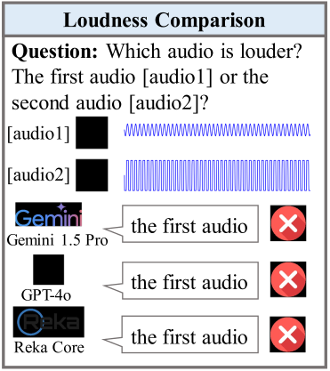
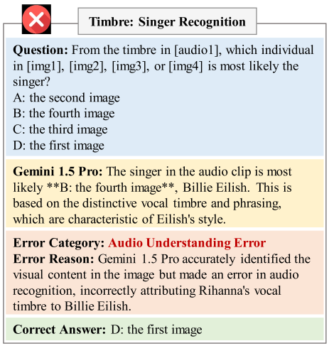
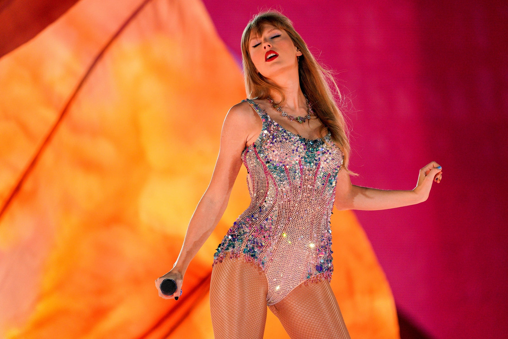

#   AV-Odyssey: Can Your Multimodal LLMs Really Understand Audio-Visual Information?

 
 
  
 
 


Official repository for the paper "[AV-Odyssey: Can Your Multimodal LLMs Really Understand Audio-Visual Information?]()".

🌟 For more details, please refer to the project page with data examples: [https://av-odyssey.github.io/](https://av-odyssey.github.io/).

[[🌐 Webpage](https://av-odyssey.github.io/)] [[📖 Paper]()] [[🤗 Huggingface Dataset](https://huggingface.co/datasets/AV-Odyssey/AV_Odyssey_Bench)] [[🏆 Leaderboard](https://huggingface.co/spaces/AV-Odyssey/AV_Odyssey_Bench_Leaderboard)]


---

## 🔥 News
* **`2024.11.24`** 🌟 We release AV-Odyssey, the first-ever comprehensive evaluation benchmark to explore whether MLLMs really understand audio-visual information.


## 👀 About AV-Odyssey

Recently, multimodal large language models (MLLMs), such as GPT-4o, Gemini 1.5 Pro, and Reka Core, have expanded their capabilities to include vision and audio modalities. While these models demonstrate impressive performance across a wide range of audio-visual applications, our proposed **DeafTest** reveals that MLLMs often struggle with simple tasks humans find trivial: 1) determining which of two sounds is louder, and 2) determining which of two sounds has a higher pitch. Motivated by these observations, we introduce **AV-Odyssey Bench**. This benchmark encompasses **26** different tasks and **4,555** carefully crafted problems, each incorporating text, visual, and audio components. All data are **newly collected and annotated by humans**, not from any existing audio-visual dataset. AV-Odyssey Bench demonstrates three major features: 1. **Comprehensive** Audio Attributes; 2. **Extensive** Domains; 3. **Interleaved** Text, Audio, and Visual components.


## 📐 Data Examples

Please refer to our project page https://av-odyssey.github.io/ for exploring more examples.

### 📍DeafTest

<div class="columns is-centered m-6">
  <div class="column is-full has-text-centered content">
    <div class="box m-5">
      <div id="results-carousel" class="carousel results-carousel">
        <div class='content has-text-centered'>
          <div style="display: flex; justify-content: space-between; align-items: center;">
            <div style="flex: 1;">
              
            </div>
            <div style="flex: 1; display: flex; flex-direction: column; justify-content: space-between;">
              <div style="margin-bottom: 20px;">
                <p>[audio1]</p>
                <audio controls>
                  <source src="assets/31_6_1.wav" type="audio/mpeg">
                  您的浏览器不支持音频元素。
                </audio>
              </div>
              <div>
                <p>[audio2]</p>
                <audio controls>
                  <source src="assets/31_6_2.wav" type="audio/mpeg">
                  您的浏览器不支持音频元素。
                </audio>
              </div>
            </div>
          </div>
        </div>
      </div>
    </div>
  </div>
</div>


### 📍AV-Odyssey Bench

<div style="display: flex; flex-wrap: wrap; justify-content: space-between; align-items: flex-start;">
  <!-- 第一列：图片 1，竖向居中 -->
  <div style="flex: 0 0 48%; display: flex; flex-direction: column; justify-content: center; align-items: center; text-align: center;">
    <h3>Question</h3>
    
  </div>
  <!-- 第二列：图片 2 + 音频 -->
  <div style="flex: 0 0 48%; display: flex; flex-direction: column; justify-content: center; align-items: center; text-align: center;">
    <!-- 音频 -->
    <div style="margin-bottom: 30px;">
      <p>[audio1]</p>
      <audio controls>
        <source src="assets/2_26_1.wav" type="audio/mpeg">
        您的浏览器不支持音频元素。
      </audio>
    </div>
    <!-- 图像容器 -->
    <div style="display: grid; grid-template-columns: repeat(2, 1fr); gap: 15px; align-items: center; justify-items: center;">
      <div>
        <p>[img1]</p>
        
      </div>
      <div>
        <p>[img2]</p>
        
      </div>
      <div>
        <p>[img3]</p>
        
      </div>
      <div>
        <p>[img4]</p>
        
      </div>
    </div>
  </div>
</div>


## 🔍 Dataset

**License**:
```
AV-Odyssey is only used for academic research. Commercial use in any form is prohibited.
The copyright of all videos belongs to the video owners.
If there is any infringement in AV-Odyssey, please email libohao1998@gmail.com and we will remove it immediately.
Without prior approval, you cannot distribute, publish, copy, disseminate, or modify AV-Odyssey in whole or in part. 
You must strictly comply with the above restrictions.
```

Please send an email to **[libohao1998@gmail.com](mailto:libohao1998@gmail.com)**. 🌟


## 🔮 Evaluation Pipeline


## 🏆 Leaderboard

### Contributing to the AV-Odyssey Leaderboard

🚨 The [Leaderboard](https://huggingface.co/spaces/AV-Odyssey/AV_Odyssey_Bench_Leaderboard) for AV-Odyssey is continuously being updated, welcoming the contribution of your excellent MLLMs! 


## :black_nib: Citation

If you find our work helpful for your research, please consider citing our work.   

```bibtex

```
